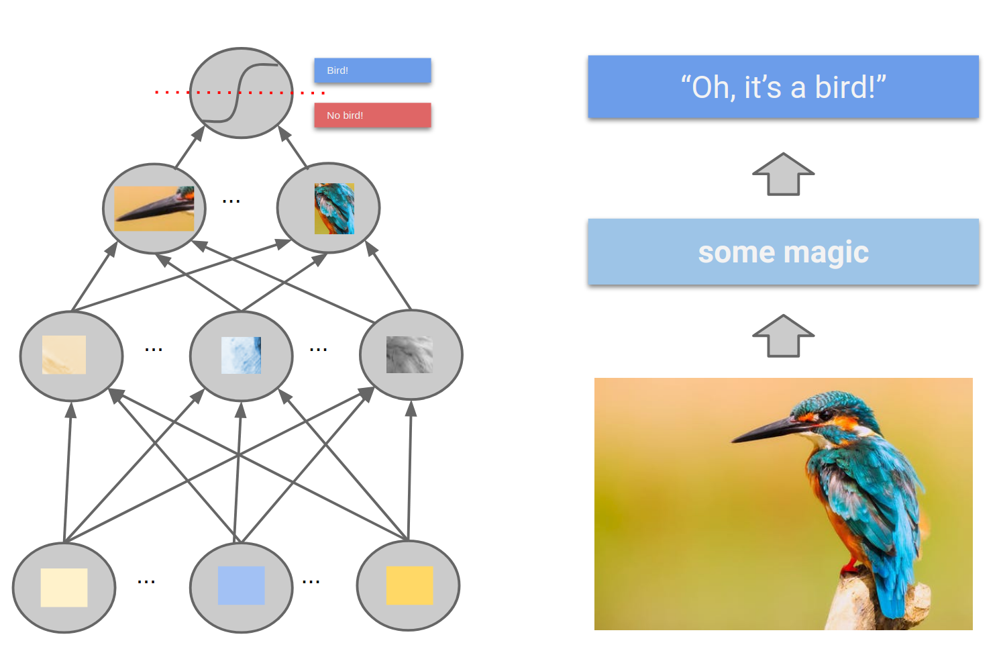
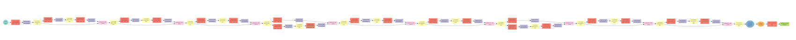

```{r setup, include=FALSE}
knitr::opts_chunk$set(echo = FALSE)
library(reshape2)
library(ggplot2)
library(mlr)
library(mlrMBO)
library(mxnet)
#source("data/read_data.R")
source("https://raw.githubusercontent.com/mlr-org/mlr-extralearner/master/R/RLearner_classif_mxff.R")
```


## Deep Neural Networks



## Deep learning with mlr?

__Why?__

* Methods for tuning, resampling, benchmarking and visualization
* Easy comparison with a large number of other ML algorithms
* Well integrated into other packages, e.g., __mlrMBO__

<br><br>

__Why not?__

* No data loaders and on the fly preprocessing
* No data structure for image or text data, only data.frame
* Parameter definition by __ParamHelpers__ not ideal for DNNs


## Software

* Currently implemented: __Apache MXNet__
* Not included in __mlr__ (yet)
* Can be called from the __mlr-extralearner__ repository:

```{R, echo = TRUE, eval = FALSE}
source("https://raw.githubusercontent.com/mlr-org/mlr-extralearner/master/R/RLearner_classif_mxff.R")
lrn = makeLearner("classif.mxff")
```

* Implementation:
    * Regression (including prediction uncertainty by dropout) and classification
    * Fully connected and convolutional networks (up to 4 layer)
    * Arbitrary architectures as symbols
    * Dropout & Batch Normalization


## LeNet


## LeNet in mlr

```{R, echo = TRUE, eval = FALSE}
lenet = makeLearner(cl = "classif.mxff",
  layers = 3,
  conv.layer1 = TRUE,
  num.layer1 = 20,
  conv.kernel1 = c(5, 5),
  act1 = "tanh",
  pool.kernel1 = c(2, 2),
  pool.stride1 = c(2, 2),
  conv.layer2 = TRUE,
  num.layer2 = 50,
  conv.kernel2 = c(5, 5),
  act2 = "tanh",
  pool.kernel2 = c(2, 2),
  pool.stride2 = c(2, 2),
  conv.layer3 = FALSE,
  num.layer3 = 500,
  act3 = "tanh",
  conv.data.shape = c(28, 28)
)
```

## LeNet in mlr

Set additional hyperparameter:

```{R, echo = TRUE, eval = FALSE}
lenet = setHyperPars(lenet,
  optimizer = "sgd",
  learning.rate = 0.01,
  momentum = 0.9,
  num.round = 200,
  ctx = mx.gpu()
)
```

```{R, echo = TRUE, eval = FALSE}
mod = train(lenet, mnist.task)
```

## LeNet symbol

__Also possible:__ Create architecture directly and pass it to __mlr__

```{R, echo = TRUE, eval = FALSE}
data = mx.symbol.Variable('data')
conv1 = mx.symbol.Convolution(data = data, kernel = c(5,5), num_filter = 20)
tanh1 = mx.symbol.Activation(data = conv1, act_type = "tanh")
pool1 = mx.symbol.Pooling(data = tanh1, pool_type = "max", kernel = c(2,2), stride = c(2,2))
conv2 = mx.symbol.Convolution(data = pool1, kernel = c(5,5), num_filter = 50)
tanh2 = mx.symbol.Activation(data = conv2, act_type = "tanh")
pool2 = mx.symbol.Pooling(data = tanh2, pool_type = "max", kernel = c(2,2), stride = c(2,2))
flatten = mx.symbol.flatten(data = pool2)
fc1 = mx.symbol.FullyConnected(data = flatten, num_hidden = 500)
tanh3 = mx.symbol.Activation(data = fc1, act_type = "tanh")
fc2 = mx.symbol.FullyConnected(data = tanh3, num_hidden = 10)
lenet.sym = mx.symbol.SoftmaxOutput(data = fc2, name = 'softmax')
```


## LeNet symbol

```{R, echo = TRUE, eval = FALSE}
lenet = makeLearner("classif.mxff",
  symbol = lenet.sym,
  conv.layer1 = TRUE
  optimizer = "sgd",
  learning.rate = 0.01,
  momentum = 0.9,
  num.round = 200,
  eval.metric = mx.metric.accuracy,
  validation.ratio = 0.2,
  epoch.end.callback = mx.callback.early.stop(bad.steps = 5, maximize = TRUE),
  ctx = mx.gpu()
)
```

__Note:__ All architecture parameters are ignored

## More complex Architectures

Download predefined CNN architectures from:
https://github.com/apache/incubator-mxnet/tree/master/example


```{R, echo = TRUE, eval = FALSE}
source("https://raw.githubusercontent.com/apache/incubator-mxnet/master/example/image-classification/symbol_resnet-28-small.R")
resnet.sym = get_symbol(num_classes = 10)
graph.viz(resnet.sym)
```


## More complex Architectures

```{R, echo = TRUE, eval = FALSE}

resnet = makeLearner("classif.mxff",
  symbol = resnet.sym,
  conv.layer1 = TRUE,
  optimizer = "sgd",
  learning.rate = 0.01,
  momentum = 0.9,
  num.round = 200,
  ctx = mx.gpu()
)

train(resnet, mnist.task)
```


## Early Stopping

Add __epoch.end.callback__ parameter:

```{R, echo = TRUE, eval = FALSE}
resnet = setHyperPars(resnet,
  eval.metric = mx.metric.accuracy,
  validation.ratio = 0.2,
  epoch.end.callback = mx.callback.early.stop(bad.steps = 10, maximize = TRUE),
)
```


## Transfer Learning

Pass pretrained weights as parameters:

```{R, echo = TRUE, eval = FALSE}
resnet.mod = train(lrn.resnet, task)
resnet.weights = getLearnerModel(resnet.mod)

resnet.pretrained = makeLearner("classif.mxff",
  symbol = resnet.sym,
  args.params = resnet.weights$args.params,
  aux.params = resnet.weights$aux.params,
  conv.layer1 = TRUE,
  optimizer = "sgd",
  learning.rate = 0.01,
  momentum = 0.9,
  num.round = 200,
  ctx = mx.gpu())
)
```


## Hyperparamter Tuning

Use __mlr__ tuning methods:

```{R, echo = TRUE, eval = FALSE}
lenet.custom = makeLearner(cl = "classif.mxff",
  layers = 3,
  conv.layer1 = TRUE,
  conv.kernel1 = c(5, 5),
  act1 = "tanh",
  pool.kernel1 = c(2, 2),
  pool.stride1 = c(2, 2),
  conv.layer2 = TRUE,
  conv.kernel2 = c(5, 5),
  act2 = "tanh",
  pool.kernel2 = c(2, 2),
  pool.stride2 = c(2, 2),
  conv.layer3 = FALSE,
  act3 = "tanh",
  conv.data.shape = c(28, 28)
)
```


## Hyperparameter Tuning

Tune layer sizes and learning rate with Bayesian optimization in a few lines of code:

```{R, echo = TRUE, eval = FALSE}
par.set = makeParamSet(
  makeNumericParam(id = "learning.rate", lower = 0.01, upper = 0.3),
  makeNumericParam(id = "momentum", lower = 0.7, upper = 0.99),
  makeIntegerParam(id = "num.layer1", lower = 10, upper = 50),
  makeIntegerParam(id = "num.layer2", lower = 10, upper = 50),
  makeIntegerParam(id = "num.layer3", lower = 100, upper = 1000)
)

ctrl = makeMBOControl()
ctrl = setMBOControlTermination(ctrl, time.budget = 10)
tune.ctrl = makeTuneControlMBO(mbo.control = ctrl)
result = tuneParams(learner = lenet.custom, task = task, resampling = hout,
  par.set = par.set, control = tune.ctrl, show.info = TRUE)
```


## Thank You!

<br>
<br>

### Questions?

<br>
<br>
<br>

### Contact:
- janek.thomas@stat.uni-muenchen.de
- https://compstat.statistik.uni-muenchen.de
- https://janekthomas.de
